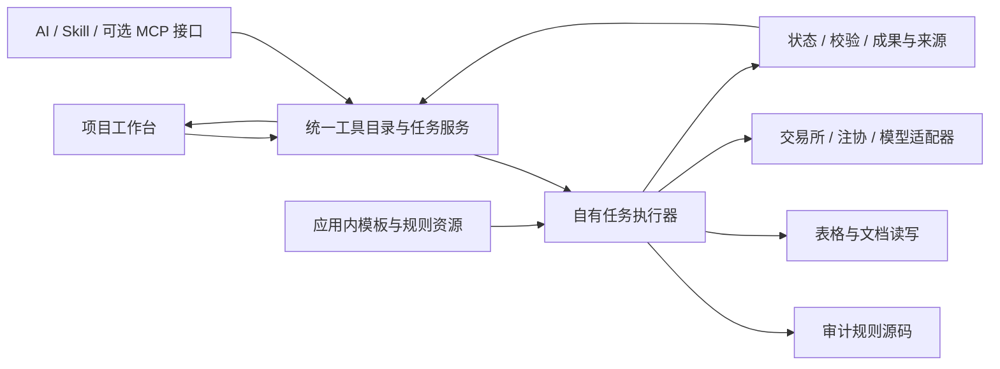

# AI 审计助手独立迁移实现分析

日期：2026-10-10。分析对象：当前 `0.1.0-internal.28` 项目与桌面 `SW审计工具箱`。本文件是实现方案，不代表下列功能已经迁移完成。最初的静态分析未运行旧业务模块；后续已开展 [JET 核心逻辑提取与验证](JET核心逻辑提取与验证-20261010.md)。研究实现尚未接入客户端，没有修改生产业务执行代码。

## 1. 结论与已核实的事实

推荐路线是：**把业务规则形成可验证的规格，在新项目中实现自己的处理引擎；模板随应用发布；本地界面和 AI 使用同一个执行入口。旧程序只在研究和结果对照时使用，正式运行与安装包不依赖旧工具箱。**

完整源码如果可取得，应优先拆出业务实现和资源。当前检查的原安装目录没有提供这些业务模块的 `.py` 源码，因此不能把复制接口文件当成迁移。

|项目|本轮观察|对实现的影响|
|---|---|---|
|旧 MCP 注册项|63 个，参数定义在 `src/resources/legacy-mcp-tools.json`|这是接口数量，需要继续拆参数模式和子操作，不能直接作为全部业务功能数量|
|旧业务模块|`modules` 下 216 个 `.pyd`、2 个 JSON，没有 `.py/.pyx/.pyc`|需要研究编译实现或原程序行为，再重写；216 是文件数，包含界面和支撑模块|
|旧 `src` 目录|只有 1 个 PNG、2 个 JPG|目录名称不能当作业务源码存在的证据|
|编译线索|107 个 `.pyd` 含 `__pyx_` 标记|这些是 Cython 线索；不能推断所有模块由同一工具编译|
|提取的注册字节码|`registry.bin` 是 `MCP_MODULE_NAMES` 的 63 项模块路径清单|它能建立接口与旧模块的映射，不能代替这些模块的算法实现|
|提取的服务字节码|`mcp_server.bin` 含模块发现、导入和工具分派代码|替换服务壳仍然不能消除它需要导入旧业务模块的事实|
|新程序内置操作|16 项，主要逻辑在 `src/audit-worker/worker.py`|可复用已有执行、读写和部分规则；不能认为同名旧功能的全部参数已覆盖|
|模板资源|75 个：66 个 XLSX、9 个 XLSM；9 个 XLSM 均含 VBA；18 个模板含 drawing 部件|模板、宏、公式和布局必须单独迁移与验证|
|Skill 文件|8 个：5 个业务流程说明、3 个技能维护说明|说明文件不是执行器；还要落实它引用的工具及参数|

上述数量来自本轮静态检查，证据、文件 hash 和分析脚本在 [迁移证据](research/progress-20261010/migration-analysis-20261010/evidence.json)。未读取旧 `config.json`、业务数据库、`projects` 或 `output`。

原生扩展与 Python 字节码要分开研究：Cython 可以生成 Windows `.pyd` 扩展；`dis` 针对 CPython 字节码，且字节码跨版本不保证兼容。分析注册字节码不能用来声称已反编译业务 `.pyd`。[Cython 官方教程](https://cython.readthedocs.io/en/latest/src/tutorial/cython_tutorial.html)、[CPython dis](https://docs.python.org/3.12/library/dis.html)。本轮仅用项目自有 Python 3.12.14 静态读取已提取 code object，没有执行其代码；`marshal` 格式也不应成为正式业务协议。[CPython marshal](https://docs.python.org/3.12/library/marshal.html)。

## 2. 独立迁移的边界和路线选择

完成后的用户环境不需要安装旧工具箱，也不需要 `SW_AUDIT_TOOLBOX_EXE`、旧目录、旧配置或旧业务二进制。新程序拥有可维护的业务实现、自己的模板目录、配置和任务结果。

独立于旧程序不等于消除全部业务依赖。IPO/公告下载仍需网络；注协查询和股权穿透仍需有效的外部服务授权；AI 操作仍需配置模型；如果某模板必须由 Excel 计算或保留特定功能，仍可能需要相应的 Excel 环境。这些依赖应明确到具体操作，不能变成全部功能的启动前提。

|路线|能解决什么|限制|建议|
|---|---|---|---|
|取得原业务源码，拆除 GUI 和工程耦合后纳入新项目|规则和参数能直接研究，保留行为较容易|仍需补依赖、移植模板并验收；当前安装目录未发现业务源码|如有可用源码，优先采用|
|接口/模板/行为对照 + 必要的二进制分析 + 新源码重写|得到自己的业务实现，安装和维护不再依赖旧工程|需要逐项确认规则，复杂算法不能凭名称重写|**当前主路线**|
|把旧 `.pyd` 及其运行时、依赖搬入新包|可能实现无需另装旧程序的安装独立|仍然复用旧编译业务，可能保留 Qt、内部上下文、ABI 和路径耦合；不等于业务源码迁移|可用于研究对照，不作为本方案最终完成标准|
|把旧 EXE 一并打包|省去用户手动安装旧程序|现有调用结构没有改变|不能替代本次独立迁移|

无需先完整反编译 216 个文件。先从 63 个公开入口追到实际核心模块，再按输入、参数、输出形成规格。可用模板或原行为确定的规则先实现；只有缺少关键依据时，才深入对应的原生模块。

## 3. 目标架构及现有项目的修改位置



MCP 是调用协议，可以继续存在，但服务端由新项目自己的实现提供。界面按钮与 AI 不应各自调用不同的业务版本。

建议新增的实现目录如下，**这些是目标文件，当前尚未创建实现**：

```text
src/audit-domain/
  table_ops.py              表格、字段、科目与辅助项转换
  subjects.py               科目层级与余额表处理
  checks.py                 凭证、账套和 JET 规则
  sampling.py               截止测试与抽样
  bank.py                   流水标准化、核对与函证数据
  analysis.py               月间与收入成本分析
  workpapers.py             明细表与小账套生成
  workbook_structure.py     链接、披露与批注处理
  relationships.py          工商资料解析与关联关系
  documents_ai.py           文档提取、核对和 AI 辅助
src/audit-worker/
  dispatcher.py             自有操作注册及任务分派
  workbook_io.py            数据读写与工作簿保真处理
  network_jobs.py           下载、取消、重试、恢复
src/connectors/
  ipo_sse.py / ipo_szse.py / ipo_bse.py
  announcements.py / cicpa.py / exchange_rates.py
src/resources/
  tool-catalog.json          唯一工具契约与别名
  templates/                随应用发布的模板
  template-manifest.json    来源、hash、资源与适用范围
src/skills/                 与自有工具契约一致的流程说明
```

可以用不同源码文件组织实现，但数据处理、工作簿修改和远端服务必须有明确边界。

|现有位置|迁移时的具体改法|
|---|---|
|`src/host/service.mjs` 的 `task.run`|保留资料校验、记录、取消和成果机制；改为按唯一工具契约选择自有执行器，已迁移操作不再调用 `LegacyMcpClient`|
|`src/workflows/mcp-runner.mjs`|旧兼容调用移出正式路径；新执行器发布真实进度、错误及结果；独立发布时禁止旧程序回退|
|`src/task-scheduler/scheduler.mjs`|扩展现有自有 Python 作业协议，支持已注册的完整操作、网络任务和文档输出；不能依靠任意脚本执行|
|`src/audit-worker/worker.py`|拆出可复用读写、金额和来源逻辑；现有 16 项操作保留明确语义，再增加旧契约需要的能力|
|`src/host/service.mjs` 的 `templates.copy`|从应用资源读取模板，按版本/hash 复制工作副本；当前来源是旧 EXE 邻接的 `_template`，必须改掉|
|`src/host/service.mjs` 的模型工具构造|当前 16 项内置工具与旧程序 `listTools()` 分开提供；改为从同一工具目录暴露可执行操作和参数|
|`src/workflows/contracts.mjs`|从目录生成界面和服务端校验；格式、参数模式、输出、依赖需逐项证实，不能靠一套默认 XLSX 规则覆盖全部|
|`src/skills/loader.mjs` 和 Skill 文件|保留需求所需的流程指导，工具名、参数、授权方法和资源路径改为新项目真实能力|
|`src/resources/mcp-migration.json`、旧 `compat.mjs`|历史的 migrated/mapped 标签不作为当前完成证据；统一迁移台账，状态由实际执行与验收决定|
|`scripts/package.mjs`|补齐 `workflows`、`skills`、新增 domain/connectors 和模板资源；当前复制目录列表遗漏 `workflows`、`skills`，尚不能证明最新版完整包可启动|

### 3.1 统一契约

每项操作要有：稳定 `featureId`、历史别名、完整参数 schema、输入角色和格式、输出格式、模板/规则版本、依赖状态、修改资料的方式、执行器位置及验收证据。

保留 `mcp_*` 等历史 ID 的解析，是为了恢复已有任务记录与真实业务语义，不要求界面继续展示旧产品名称。不能按名字直接把旧 MCP 映射到新内置操作：例如新 `add_column` 是新增固定值列，旧同名接口是处理同名列及拼接；旧 `select_column` 还包括目录、合并和工作表关键词，现有内置操作只覆盖部分。

任务输出继续保存参数快照、源文件 hash、规则/模板版本、输入输出行数、控制合计、警告、成果文件及来源定位。成功只在实际成果校验后发布；只有“生成了阶段结果 JSON”不能认定银行核对或底稿生成成功。

新工具目录应区分：业务实现已验证、需要 Excel、需要联网/外部授权、需要模型、迁移未完成。运行时缺某种依赖，只影响对应操作。

## 4. 63 个入口的迁移工作包

以下分类用于组织研发依赖与验收，**不是重新设计十个界面任务板块**。每个工具仍按实际工作对象使用。逐项入口、原模块、目标文件、格式依据和待验证行为见 [63 项逐项清单](独立迁移逐项清单-20261010.md)。

|工作包|数量|独立实现重点|主要完成条件|
|---|---:|---|---|
|P01 表格与字段处理|14|多行表头、同名列、目录汇集、辅助项、配置表驱动处理；AI 辅助与确定性步骤分开|全部参数分支、行顺序、空值、样式和文件选择行为对照|
|P02 科目与余额表|4|科目编码拆分、层级、辅助核算、期初、主体和后处理|科目结构和余额控制合计一致，派工建议可复核|
|P03 分录/账套校验与抽样|5|JET 特征规则矩阵、凭证/账套勾稽、截止测试|规则边界、跨主体凭证键、异常集合、抽样口径与来源一致|
|P04 银行|5|流水标准化、双向核对、三种函证模板|重复/拆分/汇总匹配不重复占用，金额及未匹配清单可追溯|
|P05 分析|5|本期/上期、科目方向、层级、阈值、毛利维度；AI 解释单独执行|确定性结果精确对照，解释引用实际数据|
|P06 明细底稿与小账套|6|模板批注、配置保存/校验、字段/科目/模板映射、批量生成|完整链条产生正确底稿，公式、宏及格式得到验证|
|P07 工作簿链接、披露与批注|8|外链、公式引用、路径/范围/工作簿替换、披露口径与批注|定位和替换正确，原工作簿其他部件不被破坏|
|P08 外部查询与下载|6|三交易所 IPO、公告、注协多模式、汇率|直接调用当前数据来源，无旧 EXE；分页、授权、增量和失败清单可验证|
|P09 工商资料与关联关系|2|DOCX 报告解析、人员/地址/股权关系、股权穿透|名称/关系/阈值/环路处理有证据，离线部分独立运行|
|P10 文档、文本解析与 AI|8|地址/身份证解析、公式填充、提取/分类/重命名、纸质核对|结构化输出和来源定位；模型缺失与识别不确定正确呈现|
|合计|**63**|入口无重复、无遗漏|计数已由静态检查脚本核对，尚未通过业务迁移验收|

## 5. 几项关键业务具体怎样迁移

### 5.1 IPO 披露文件下载

可以由新程序直接实现，不要求先还原旧 GUI 或其他审计算法。三个工具各自连接一个交易所适配器，共用下载/持久化框架。

1. 核对 `start_date`、`end_date`、`update_mode` 的实际含义与日期字段；不能把“按项目更新”与“按文件更新”简单合并成相同逻辑。
2. 分别实现项目列表分页、项目详情、披露文件枚举。按来源项目 ID、文件 ID/版本形成稳定标识。
3. 创建下载清单，记录公司、项目、板块、披露类型、披露日期、文件标题、来源 URL、版本、hash 与本地路径。
4. 文件先写临时路径，再验证状态、文件签名/类型和 hash；防止把 HTML 错误页当成 PDF；同名不同版本不能覆盖。
5. 持久保存已处理项目/文件；下载中断后恢复；变更和失效文件形成实际清单。是否支持 Range 续传按服务器响应决定。
6. 成果为披露原文件、索引 CSV/XLSX/JSON、失败清单和本次下载摘要。没有下载成功的文件应保持失败/部分成功，不伪造文件路径。

本轮核对了 [上交所发行上市披露](https://www.sse.com.cn/listing/disclosure/ipo/)、[深交所 IPO 披露](https://www.szse.cn/listing/disclosure/ipo/index.html)、[北交所公开发行披露](https://www.bse.cn/issue/issue_disclosure.html) 和 [北交所审核动态](https://www.bse.cn/xyz_issue/xyz_project_info.html) 页面。**这只证明公开入口存在；请求参数、分页接口、文件 URL 和增量含义仍须实现时核实，未进行实时下载验收。**

### 5.2 银行流水核对与函证

先确定账面/流水的日期、金额、借贷方向、对手名称和账号清洗规则，再研究实际匹配顺序及容差。不能仅凭“同日同金额”定义迁移完成。

合成对照应覆盖：一对一、重复金额、不同对手、跨日、冲销、手续费、分拆/合并、空对手、金额精度和同账户重复文件。对照旧结果后确认它支持哪些情形；新实现需要记录匹配规则、占用关系、匹配组、原行引用和未匹配原因。账面、流水、匹配与未匹配的控制合计必须闭合。

`bankflowmerge` 的并行参数数组必须与文件逐一对应，表头坐标及收入/支出列不能错位。三种函证入口可共用一套标准银行数据和模板引擎，但表格格式、配置项、账户分组及输出不能被简化成同一个模板。

### 5.3 JET、月间分析与毛利分析

已有 JET 规则表与 SQL 实现可作为基础。旧 `jet_test_execute` 接收 `features`、`rules`、`column_mapping`、`settings`，迁移须覆盖特征定义和自定义规则，不只复制当前内置规则清单。对负条件组合、跨主体频率、尾数处理、凭证差额及临界值逐项做行为对照；现有单元测试不能代替旧行为兼容验证。

后续核心试验已独立重写条件解析和覆盖 13 个内置特征的计算方法，5,185 次逐行比较通过，4 条规则与原 EXE 的实际 XLSX 输出相符。研究还发现 MCP 内置配置与 Excel 模板并非同一套规则：包括期末收入突击的借贷方向，以及模板中的重复规则名称。新实现必须记录规则来源，并处理无效日期填 0、空特征表不产生命中等旧边界行为；不能只选择模板或 Skill 当作唯一规则依据。详见 [核心提取结果](JET核心逻辑提取与验证-20261010.md)。

月间分析应实现：真实预览 → 科目编码层级检测 → 已确认科目/方向与本期上期数据计算 → 变化阈值和结果表 → 可选 AI 解释。现有按月汇总借贷发生额只能作为计算基础。科目上下级汇总不能重复计数，缺上期、零基数、负金额、无交易月份须定义输出。毛利分析另外核对收入/成本方向、维度、合并口径和零收入情形。

AI 负责映射建议和解释，业务金额、抽样和勾稽由确定性代码计算。AI 引用的原始凭证、表格范围或结果指标必须可回查；不能用模型输出代替规则验收。

### 5.4 明细底稿、外链和带宏工作簿

明细表的五个入口应作为一个完整实现闭环：读取数据源、读取模板批注、保存配置、校验配置、按映射生成。复用公共数据检查，不可把所有 inspect 返回同一份普通表格预览；模板检查必须返回实际模板结构和批注。

工作簿处理分为两类：纯数据导出可用自有表格读写；需要保留宏、形状、外链、公式计算或复杂布局的操作，选择经过对照的 OOXML 局部修改或自有 Excel 自动化适配。禁止把所有模板经过当前“读成表再创建新工作簿”的路径处理。

`openpyxl` 可以保存公式字符串，但不计算公式；保留 VBA 不等于执行或编辑宏，且官方指出其读写可能丢失工作簿形状。[公式文档](https://openpyxl.readthedocs.io/en/stable/simple_formulae.html)、[工作簿读写文档](https://openpyxl.readthedocs.io/en/stable/tutorial.html)。如果采用开源 `xlwings` 做实际 Excel 自动化，则仍需安装 Excel；这是该操作的外部条件，并非旧工具箱依赖。[xlwings 安装要求](https://docs.xlwings.org/en/stable/installation.html)。

模板校验须包括：Sheet 顺序/隐藏、单元格值及格式、合并区域、命名范围、公式、外链、批注、图形和打印设置；必要时校验宏部件 hash。只比较导出的数据行数不够。

### 5.5 注协查询与关联方

注协的 `search/detail/export/subsidiary/check_cookies` 是一个接口下的不同业务分支。新连接器应负责登录会话/授权失效、响应解析、分页和导出；凭据由新程序管理，不能读取旧配置取得授权，也不能把查不到数据解释为没有关联方。

关联方实现应拆出离线工商数据解析、关系判定和在线股权穿透。离线输入已有完整导出资料时，应直接执行本地分析；穿透部分单独需要网络和有效授权。股权阈值、层数、循环关系、离任高管、客户供应商名称、同名个人和地址规范化要形成可验证规则。先确认 Skill 与实际导出格式一致，不能把 Skill 写的维度/文件数量作为固定假设。

### 5.6 AI 提取、纸质核对和 Skill

每个 AI 操作需要自己的输入读取、任务提示、输出 schema、来源定位和复核状态。统一复用新项目模型连接器，但不把八项文档/文本操作改成一个通用聊天按钮。图像重命名先形成重命名计划，执行时处理重名与撤销信息；纸质核对输出识别字段、对应记录、差异和无法确认项。

5 个业务 Skill 必须逐一验证工具引用、参数和阶段成果。3 个维护 Skill 当前引用的 `create_skill`、`install_skill` 等能力并未注册在这 63 项业务接口中：要实现就单独登记真实维护能力及验收，不能仅复制说明文件后宣布可用。旧 Skill 中的任意浏览器代码、旧路径、固定 Cookie 有效期等描述要按新程序实际能力重写，不作为本轮开发指令。

## 6. 每项功能的研究和实现步骤

1. **冻结对照基线。** 保存接口/模板/原模块 hash、版本证据及实际来源，避免混用不同旧版本。
2. **拆功能契约。** 记录参数默认值、模式枚举、输入文件/工作表、修改方式、输出格式、命名、异常和控制合计。先找公开 `run`/MCP 入口，再沿依赖定位核心。
3. **设计可区分行为的样例。** 使用合成数据覆盖正常、空值、重复、精度、边界、跨文件/主体和错误输入。不能只测“能打开文件”。
4. **保存原行为。** 在独立研究目录运行原程序的正常工具入口，记录输入/参数/输出与错误；此环节允许研究机器有旧工具箱，不进入新程序正式运行链。
5. **解释不确定规则。** 用模板、Skill、静态线索和结果确定行为；仍有歧义时选择具体 `.pyd` 做 PE/字符串/调用分析或反汇编。原生伪代码只作为研究依据。
6. **编写自有实现。** 业务规则、读写、模板和远端服务分开；纳入统一工具契约和任务协议。
7. **对照验收。** 比较结果集合、行顺序、金额/控制合计、来源、工作簿结构及错误行为；抽样/排序不可为方便比较而任意归一。
8. **隔离旧环境验收。** 在无法访问旧目录、没有旧环境变量的环境运行安装包；确认没有回退调用旧程序。

如果旧程序结果与独立预期矛盾，登记具体差异，分别判断旧规则问题、输入解释和移植缺陷；不静默改业务口径来制造“相同”结果。

台账状态建议为 `observed → specified → implemented → compared → independent_verified`。联网和 Excel 条件另记为 `live_verified/excel_verified`，不能被离线模拟测试替代。统计完成率以具体功能/分支和证据为单位，目录/按钮数量不计入完成率。

## 7. 推荐执行顺序与阶段成果

|阶段|具体工作|可审查成果|
|---|---|---|
|A 基线与基础执行|补全参数/格式/依赖台账；统一工具契约；建立自有 dispatcher；模板资源与打包闭环|全项台账、资源 manifest、可运行且拒绝旧回退的试验包|
|B 三个完整试点|①旧 `select_column`：目录/合并/Sheet 筛选；②三个 IPO 入口的共用下载框架和不同适配器；③五个明细表入口的完整闭环|分别证明数据处理、直接联网与复杂底稿可独立；各有真实成果与对照报告|
|C 确定性业务全覆盖|表格/科目、JET/凭证/账套、月间/毛利、银行、函证、截止测试|规则规范、完整参数分支、合成预期、旧/新结果差异报告|
|D 工作簿与外部/AI业务|链接/披露、注协/关联方、文档识别与模型操作、维护能力|模板保真报告、联网/授权验证、AI schema 与证据定位、Skill 链条报告|
|E 独立交付验收|仅从安装包运行；新 Windows 环境、普通权限、不同用户名/路径；验证业务所需环境组合|无旧目录依赖的安装报告、操作清单与依赖说明、正式迁移台账|

这是实现顺序，不是删减范围或把未完成项移到后续版本。试点选择同时覆盖最容易复用的代码、用户关注的 IPO 和最容易遗漏的 Excel/模板依赖。没有复杂底稿试点通过之前，不能用简单表格试点推断全量可迁移成本。

目前不能给出可靠的全部工期：复杂匹配、原生规则、模板保真和注协会话仍未完成行为基线。三个试点完成后，应按实际研究/实现/验证记录估计其余条目，而不是按“63 个按钮”估算。

## 8. 独立交付的验收标准

- 安装包里包含全部正式源码、锁定的 Python/Node 运行时、必要第三方库、规则、Skill 和模板；用户无需安装 Node、Python、pnpm 或旧工具箱。
- 旧目录、旧 EXE、旧业务 `.pyd`、旧注册/server 字节码及旧账号配置不进入正式运行链；业务需要的第三方原生扩展另行正常打包。
- 在无旧工具箱的干净 Windows 环境测试；另做路径访问/进程启动记录，证明没有静默依赖或回退。不能仅把旧 EXE 改名，然后仍读取邻接模块和模板。
- 离线、联网、无/有 Excel、无/有模型与外部授权分别验证；缺少条件时明确说明对应操作限制，其他本地功能正常。
- 63 个入口与其参数分支全部有实现和独立验证证据；8 个 Skill 的引用已与实际能力对应；75 个模板逐一落实用途。可能发现的 GUI 独有功能和额外模板仍需纳入全功能总账，不能认为 63 项已穷尽原程序。
- 对结果内容、金额、来源定位、工作簿保真、失败/部分成功、中断恢复和成果接续进行验证；真实网络和 Excel 验收与离线模拟结果分开记录。

本轮完成的是现状分析、证据盘点和实现路线。仍待完成：业务行为基线、具体规则重写、外部连接器实现、全模板/参数覆盖和干净环境实际验收。
